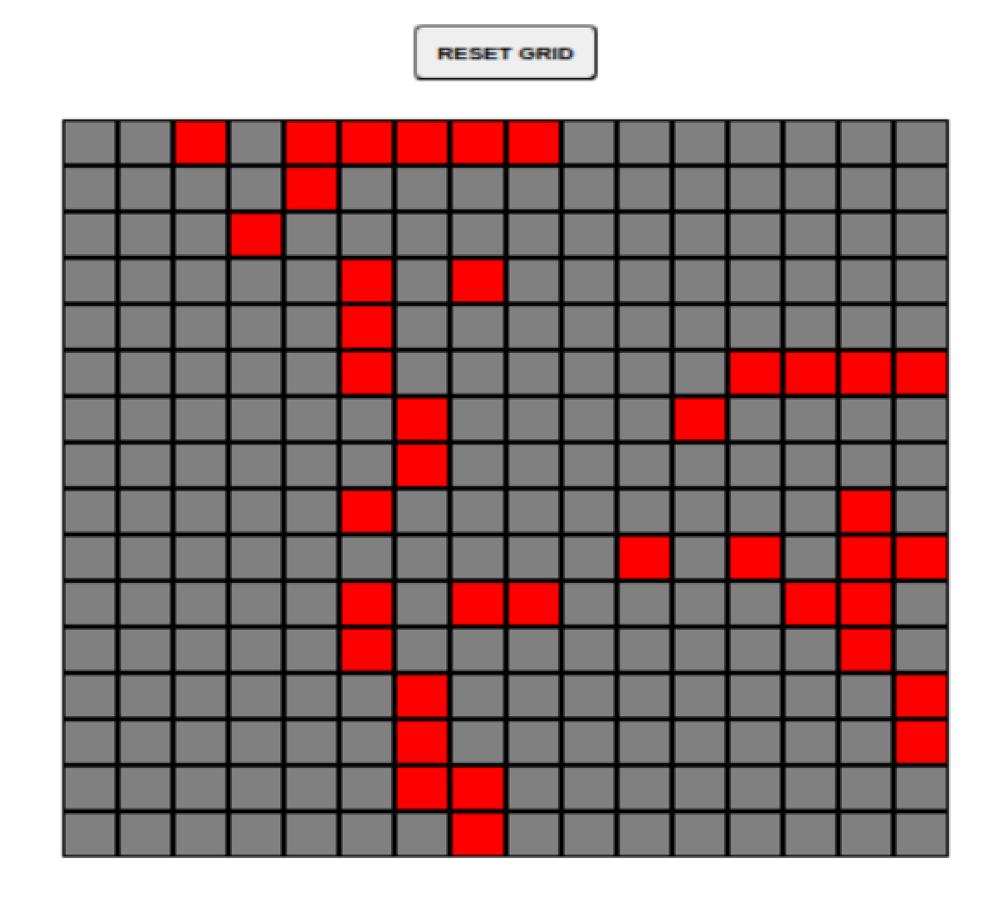

# Odin-Etch-A-Sketch
A simple page that allows users to draw with their mouse pointer and was built for _[The Odin Project](https://www.theodinproject.com/about)_

## Examples

## Inspiration
The _[Project: Etch-a-Sketch](https://www.theodinproject.com/lessons/foundations-etch-a-sketch) (JAVASCRIPT/HTML/CSS)_ is part of _[The Odin Project: Foundations](https://www.theodinproject.com/paths/foundations/courses/foundations)_ Course
